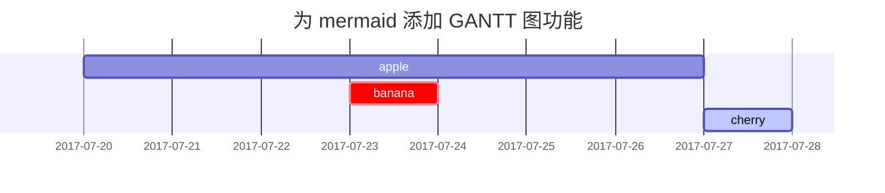

## 标题

<!-- markdownlint-capture -->
<!-- markdownlint-disable -->
# H1 — 标题
{: .mt-4 .mb-0 }

## H2 — 标题
{: data-toc-skip='' .mt-4 .mb-0 }

### H3 — 标题
{: data-toc-skip='' .mt-4 .mb-0 }

#### H4 — 标题
{: data-toc-skip='' .mt-4 }
<!-- markdownlint-restore -->

## 段落

这是示例段落文字。你可以在这里看到段落的基本排版效果。为了演示中文段落，这里写一些通用内容：中文排版通常采用首行缩进与两端对齐，阅读起来更加舒适。这里继续补充一些文字，让段落显得更完整，以便观察行距与字间距的实际效果。

## 列表

### 有序列表

1. 第一项
2. 第二项
3. 第三项

### 无序列表

- 章
  - 节
    - 段

### 待办列表

- [ ] 任务
  - [x] 步骤 1
  - [x] 步骤 2
  - [ ] 步骤 3

### 描述列表

太阳
: 地球围绕其公转的恒星

月亮
: 地球的天然卫星，通过反射太阳光而可见

## 引用块

> 这行文字展示了_引用块_的效果。

## 提示框

<!-- markdownlint-capture -->
<!-- markdownlint-disable -->
> 一个展示 `tip` 类型提示框的示例。
{: .prompt-tip }

> 一个展示 `info` 类型提示框的示例。
{: .prompt-info }

> 一个展示 `warning` 类型提示框的示例。
{: .prompt-warning }

> 一个展示 `danger` 类型提示框的示例。
{: .prompt-danger }
<!-- markdownlint-restore -->

## 表格

| 公司                    | 联系人         | 国家      |
| :---------------------- | :------------- | --------: |
| 示例食品贸易公司        | 张三           | 中国      |
| 示例岛际贸易公司        | 李四           | 英国      |
| 示例餐饮集团            | 王五           | 意大利    |

## 链接

<http://127.0.0.1:4000>

## 脚注

点击挂钩可以定位到脚注[^footnote]，这里是另一个脚注[^fn-nth-2]。

## 行内代码

这是 `行内代码` 的一个示例。

## 文件路径

这里是 `/path/to/the/file.extend`{: .filepath}。

## 代码块

### 普通

<!-- markdownlint-disable-next-line MD040 -->
```
这是一个普通代码片段，没有语法高亮和行号。
```

### 指定语言

```bash
if [ $? -ne 0 ]; then
  echo "命令没有成功执行。";
  # 处理或退出
fi;
```

### 指定文件名

```sass
@import
  "colors/light-typography",
  "colors/dark-typography";
```
{: file='_sass/jekyll-theme-chirpy.scss'}

## 数学公式

由 [**MathJax**](https://www.mathjax.org/) 渲染的数学公式：

$$
\begin{equation}
  \sum_{n=1}^\infty 1/n^2 = \frac{\pi^2}{6}
  \label{eq:series}
\end{equation}
$$

我们可以将公式引用为 \eqref{eq:series}。

当 $a \ne 0$ 时，$ax^2 + bx + c = 0$ 有两个解，分别是

$$ x = {-b \pm \sqrt{b^2-4ac} \over 2a} $$

## Mermaid SVG



## 反向脚注

[^footnote]: 脚注来源
[^fn-nth-2]: 第二个脚注来源
